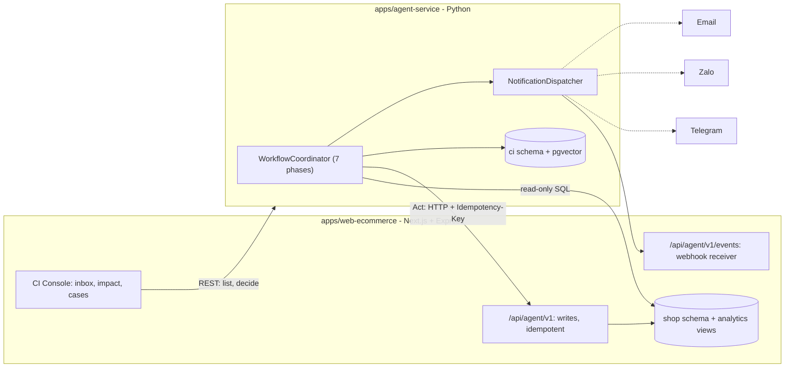

# Architecture: SME CI Platform

The agent does not just chat or make a recommendation. It runs a **closed loop**:
data -> reasoning -> decision -> action -> measurement -> learning, using the e-commerce web
app as the environment it observes and acts on.

## 1. Design principles

1. **The LLM proposes, code acts.** The reasoner has no tools at all (ADR-0008); its output is a
   `Finding` with `OptionPreview`s. Act only runs a hash-protected `ActionPlan` after a human
   (or the bounded autonomy policy) approves a `Directive` (ADR-0003, ADR-0006).
2. **Read-only reads, writes through the web app's API.** Reads go through a read-only view;
   writes go through the web app's Agent API so its business rules, validation and audit
   trail always apply (ADR-0002).
3. **Deterministic where possible.** Detect, Act and Measure use no LLM. Money and inventory
   numbers are computed in `domain/strategies/*`, never invented by a model (ADR-0004).
4. **Human approval is durable state, not a paused process** (ADR-0005). Waiting for an answer
   costs nothing and survives a restart.
5. **Clean layering, enforced by a test.** `domain` has zero framework imports and never
   imports `application`/`infrastructure`; `application` orchestrates through ports only.
   `tests/architecture/test_layering.py` fails the build on a violation.

## 2. The loop

```
Detect -> Investigate -> Ask -> Improve -> Act -> Measure -> Learn
```

| Phase | Nature | Key module | In -> Out |
|---|---|---|---|
| Detect | deterministic (rules over a snapshot) | `domain/detectors/*` | `ShopSnapshot` -> `Signal` |
| Investigate | LLM (or rule-based) + strategies | `application/use_cases/investigate.py` | `Signal` + SOP + similar cases -> `Finding` (causes + ranked `OptionPreview`s) |
| Ask | notify, wait for a decision (or auto-approve if low-risk) | `application/use_cases/ask_human.py`, `submit_answer.py` | `Finding` -> `Directive` (bounded authority) |
| Improve | deterministic (strategy compiles the directive) | `application/use_cases/plan_improvement.py` | `Directive` -> guardrail-checked `ActionPlan` |
| Act | deterministic (command executor, idempotent, compensable) | `application/use_cases/execute_plan.py` | `ActionPlan` -> `ActionRecord[]` |
| Measure | deterministic, runs when due | `application/use_cases/measure_outcome.py` | KPIs vs. baseline -> `MeasurementResult` |
| Learn | LLM (or rule-based) summarises | `application/use_cases/learn.py` | outcome (incl. rejections/failures) -> `CaseRecord` |

Every `ImprovementStatus` (`domain/models/improvement.py`) maps to exactly one phase via
`_PHASE_OF`. `WorkflowCoordinator.advance()` runs automatic phases until the improvement needs
an outside event (an answer, or the measurement date); a scheduler tick and a submitted answer
both just call it, and it is safe to call repeatedly.

## 3. System overview



One Postgres instance, two databases. The web shop's database belongs to the web app; the agent reads only its
`analytics` views, as the read-only role `ci_reader` (`infra/sql/ci_reader.sql`), and writes to the shop only
through the web Agent API. The agent's own state (improvements, cases, audit and notification logs, LLM spend) is in
schema `ci` of its own database `ci_agent`, owned by the role `ci_agent` (`infra/sql/ci_agent.sql`), which can read or write no
table or view of the shop's database. The agent applies its schema at startup and refuses a schema version it does not
know.

## 4. Directory layout (Clean Architecture)

```
sme-ci-platform/
├── apps/
│   ├── web-ecommerce/                # existing Next.js + Express shop (kept as-is, see its docs/)
│   └── agent-service/
│       ├── src/ci_agent/
│       │   ├── domain/                # pure Python, zero framework imports
│       │   │   ├── models/            #   shop, signal, finding, human, plan, measurement, case,
│       │   │   │                      #   notification, audit, improvement (the aggregate root)
│       │   │   ├── detectors/         #   Detect-phase rules + registry
│       │   │   ├── strategies/        #   Improve-phase strategies (deterministic math) + registry
│       │   │   ├── policies/          #   guardrails, autonomy, approval role rules
│       │   │   ├── services/          #   measurement_evaluator, directive_factory
│       │   │   ├── kpi.py, errors.py, events.py
│       │   ├── application/           # orchestration; depends only on domain + its own ports
│       │   │   ├── ports/             #   shop, repositories, notifications, reasoning, knowledge,
│       │   │   │                      #   events, system - one Protocol per capability
│       │   │   ├── commands/          #   Act-phase Command pattern (+ compensation)
│       │   │   ├── services/          #   command_executor, notification_*, recorder
│       │   │   └── use_cases/         #   one per phase + workflow.py (WorkflowCoordinator)
│       │   ├── infrastructure/        # adapters implementing application/ports
│       │   │   ├── shop/              #   fake_shop (dev/test), http_action, sql_read (stub)
│       │   │   ├── reasoning/         #   rule_based (default), llm_reasoner + llm_clients (ollama, claude), prompts/
│       │   │   ├── notifications/     #   web_inbox, telegram, zalo, email_smtp, console, directory
│       │   │   ├── persistence/       #   in_memory, postgres/ (schema.sql, repository, stores, serialization)
│       │   │   ├── knowledge/         #   in_memory_sop (keyword search)
│       │   │   ├── events/            #   recording (tests), web_webhook (signed HTTP)
│       │   │   ├── http/, system/     #   json http client, clock, ids, hmac signer
│       │   ├── interfaces/            # HTTP boundary
│       │   │   ├── http/              #   FastAPI app, routers, schemas, auth (stub)
│       │   │   ├── webhooks/          #   telegram, zalo
│       │   │   └── cli.py             #   `simulate` - runs the whole loop against FakeShop
│       │   ├── config/settings.py     # pydantic-settings, one source of truth for env vars
│       │   └── bootstrap/             # composition root: wiring.py (pure), container.py (real
│       │                              # adapters), demo.py (in-memory world for tests/CLI)
│       ├── data/sop/                  # sample SOP markdown, indexed by InMemorySopKnowledge
│       └── tests/{unit,e2e,contract,architecture}/
├── packages/contracts/                # OpenAPI both directions + event schema
├── infra/                             # docker-compose (Postgres + pgvector)
├── .claude/{agents,skills}/           # Claude Code subagents and skills for this repo
└── docs/                              # this file, adr/, ROADMAP.md, NOTIFICATIONS.md
```

**Dependency rule** (enforced by `tests/architecture/test_layering.py`):
`domain` <- `application` <- `infrastructure`/`interfaces`. The reverse is forbidden. Only
`bootstrap/container.py` knows every concrete adapter.

## 5. The Improvement aggregate

`domain/models/improvement.py::Improvement` is the aggregate root that carries one issue through
the whole loop. All transition rules live in it; every method takes `now` explicitly (no
`datetime.now()` inside the domain).

```
detected -> investigating -> awaiting_human -> approved -> planned -> acting -> acted -> measuring -> learning -> closed
                 |                  | \-> rejected/expired -----------------------------------------> learning -> closed
                 \-> dismissed -----+                                                                  learning -> closed
                                    (acting -> act_failed -> acting [retry] or -> learning)
```

Two protections matter most:

- **Plan hash.** `ActionPlan.plan_hash` covers the strategy and every action's type/params.
  `Improvement.start_action()` calls `plan.verify()`, which raises `IntegrityError` if anything
  changed after `Improve` attached the plan.
- **Baseline captured atomically with the start of Act.** `start_action()` takes the baseline
  KPI snapshot as a parameter and stores it once, so `Measure` always compares against the
  state immediately before the change - not the state at Ask time, which may be stale.
- **Every terminal path (rejected, expired, dismissed, executed, failed) reaches `Learn`.** A
  rejection is exactly as valuable to `CaseRecord` as a success (ADR-0004's sibling insight).

## 6. Design patterns and where they're used

| Pattern | Where | Why |
|---|---|---|
| Hexagonal (ports & adapters) | `application/ports/*` + `infrastructure/*` | Swap `FakeShop` <-> the real web app, `RuleBasedReasoner` <-> an LLM, in-memory <-> Postgres, without touching use cases |
| Anti-corruption layer | `infrastructure/shop/*` (read/write adapters map to `domain/models/shop.py`) | The web app's own schema never leaks into the domain |
| Aggregate + state machine | `domain/models/improvement.py` | Every legal transition and invariant (hash, baseline) lives in one place |
| Strategy + registry | `domain/strategies/*` | Adding a way to handle dead stock/returns is one file + one decorator |
| Command (+ compensation) | `application/commands/*`, `services/command_executor.py` | Act is idempotent, retryable, and rolls back on partial failure |
| Specification | `domain/policies/guardrails.py` | Composable, independently testable limits (discount cap, blast radius, budget) |
| Adapter (provider clients) | `infrastructure/reasoning/llm_clients.py` | Swap the LLM provider via config only (`LLM_PROVIDER`); prompts, validation and fallback stay shared in `llm_reasoner.py` |
| Repository | `application/ports/repositories.py`, `infrastructure/persistence/*` | Persistence is swappable and has its own contract test |
| Composition root | `bootstrap/container.py` (real), `bootstrap/demo.py` (in-memory) | Exactly one place assembles concrete adapters into the workflow |
| Case-based reasoning | `CaseRecord` + `CaseMemoryPort`, used by `investigate.py::rank_options` | Past outcomes (including failures and rejections) bias future ranking |

## 7. Web integration

`apps/web-ecommerce` is a Next.js 14 app served by a custom Express server, with decorator
controllers (`src/app/api/*.Controller.ts`) and Sequelize models. Its own conventions are in
`apps/web-ecommerce/docs/PROJECT_OVERVIEW.md`; the CI integration follows them.

- **Agent API** (`packages/contracts/openapi/web-agent-api.yaml`, `AgentApi.Controller.ts` ->
  `AgentActionService`): `/api/agent/v1/*` for writes (inventory, pricing, tasks, channels, SOP
  checklists, revert). Service token (`AgentServiceAuth.Middleware.ts`) and `Idempotency-Key` on
  every call; the `agent_action` table is both the idempotency store and the undo log (same key +
  same body replays, different body -> `409`). Effects are real: a discount is a `product_discount`
  row priced into the storefront, cart and checkout (the list price is never changed); an inventory
  adjustment sets `product.inventoryStatus` (anything but `available` hides the product); a channel
  switch sets `product.salesChannel` (`outlet` badge and filter).
- **Events webhook** (`AgentEvents.Controller.ts` -> `CiEventService`): verifies
  `X-CI-Signature: sha256=<hmac>` over the raw body (captured in `server.ts`), stores every event in
  `ci_event` and `notification.created` events in `ci_notification` (deduplicated). The UI polls;
  live push is ROADMAP T-09.
- **CI Console** (`/admin/ci/*` pages: inbox and decision, agent tasks, KPI impact, case library;
  `AdminCi.Controller.ts` -> `CiConsoleService`): an admin proxy to this service. It maps the agent's JSON to the console's types and never exposes the agent
  to browsers.
- **Analytics views** (ROADMAP T-03a): the web app recreates `analytics.stock_on_hand` (sellable
  products only), `units_sold_30d`, `returns` (received returns) and `clearance_sales` on every start
  (`src/core/server/database/analytics/AnalyticsViews.ts`); amounts are VND and no view exposes customer
  data. The agent reads them as `ci_reader` (`infra/sql/ci_reader.sql`): USAGE on `analytics` and SELECT on
  its views only, sessions read-only by default, default privileges FOR the web app's own role so recreated
  views stay readable. Feedback (reviews) is deferred to T-01. `infrastructure/shop/sql_read.py` reads
  them in one read-only, repeatable-read transaction per call; a missing view, a missing grant or an
  unreachable database is a `ShopReadUnavailable`, which the API answers with a 503 that says why.
- **Money**: the shop is in VND; the domain works in an internal unit (`MONEY_UNIT_VND`, default 25,000
  VND) so its thresholds and per-unit constants keep their meaning. The read adapter divides, the HTTP
  layer (`interfaces/http/money.py`) multiplies back, so the console shows VND; agent-written text
  (summaries, guardrail messages, assumptions, notification bodies) is written in VND through
  `domain/models/money.py::MoneyFormat` (ADR-0007, a formatting-only domain exception).
- **Auth** (ROADMAP T-04): browsers never call the agent. The web app's admin proxy checks the
  user's session, then mints a short-lived HS256 **actor token** (`typ=ci_actor`, `sub`, `ci_role`,
  at most 300 s, signed with `AGENT_ACTOR_SECRET`) for each call. `interfaces/http/auth.py` verifies it
  on every route except `/health` and the channel webhooks. The agent never holds the web's session
  secret, so it can check who is acting but cannot forge a web session. In the other direction the
  agent calls the Agent API with the static service token `SHOP_API_TOKEN` and signs events with
  `WEB_EVENTS_SECRET`. The claims are specified in `packages/contracts/openapi/agent-service.yaml`.

## 8. Safety and control

- **Autonomy levels** (ADR-0006): `always_ask` (default) or `auto_low_risk`, configured per
  deployment. Auto-approved actions are still recorded, audited, and notified to admins.
- **Guardrails** (`domain/policies/guardrails.py`) reject a plan before Act: it must stay
  within the approved SKU scope and discount cap, plus global ceilings (discount %, blast
  radius, cost) that apply even if a directive somehow allowed more.
- **Append-only audit** (`AuditLogPort`) for every state transition, tagged with `improvement_id`.
- **Prompt injection**: customer-supplied text (returns reasons, feedback) can only influence
  the *content* of a proposal, never trigger a write - the reasoner has no write tool.

## 9. Testing strategy

| Layer | Checks | Tooling |
|---|---|---|
| unit | `Improvement` state machine, guardrails, strategies' math, command executor | `tests/unit/`, no I/O |
| architecture | layering rule (`domain`/`application` cannot import outward) | `tests/architecture/test_layering.py`, plain `ast` |
| e2e | the whole loop against `FakeShop`, from Detect to a closed `CaseRecord` | `tests/e2e/`, no network |
| contract | every repository and store, in memory and in Postgres (the Postgres half runs when `AGENT_TEST_DATABASE_URL` points at a throwaway database from `infra/sql/ci_agent.sql`) | `tests/contract/` |
| manual | `python -m ci_agent.interfaces.cli simulate [--auto-approve]` | fastest way to see it work end to end |

## 10. Build order

See `docs/ROADMAP.md` for the numbered tasks (T-01..T-10) and a suggested order. In short: wire
the web app's Agent API and a minimal proposal inbox first (so a human can actually answer),
then real reads, then the LLM reasoner, then Postgres, then the remaining channels/case memory.

## 11. Open questions

- The Next.js app's actual folder structure, ORM (Prisma/Drizzle/other) and auth mechanism -
  needed to finalize the `analytics` views (T-03). (Auth is settled: see section 7 and T-04.)
- Official KPI definitions for finance (cost basis vs. retail value, evaluation window length).
- Which of Telegram/Zalo/Email is actually needed for the hackathon demo, so T-05 (Zalo
  verification) can be skipped if out of scope.
