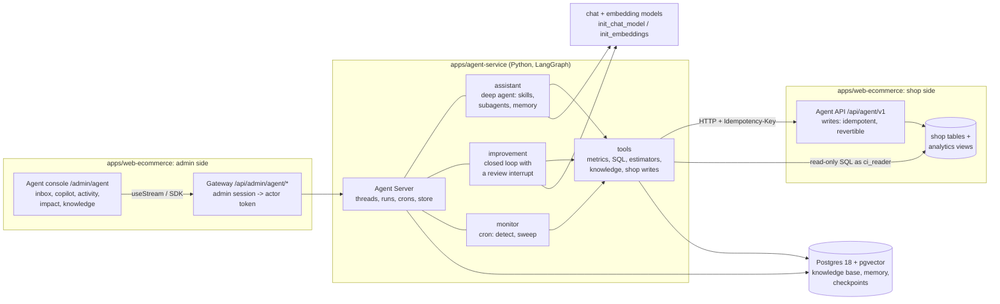
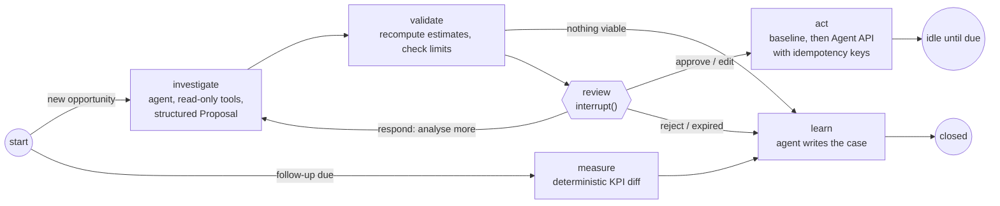
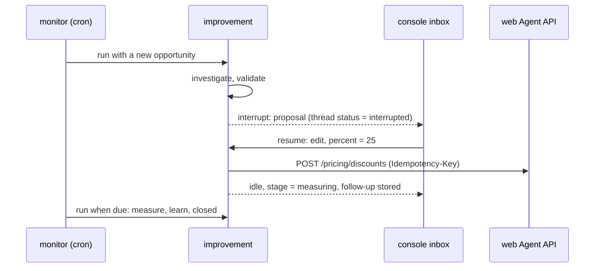

# Architecture: Shop Agent on LangGraph

> **Status: accepted on 2026-09-30; being implemented.** Decision records: ADR-0009 to ADR-0014. The phased
> implementation plan is `docs/plans/2026-09-30-agent-v2-refactor-and-growth-agent.md`; progress is tracked in
> `docs/ROADMAP.md`. The growth agent (posts, ads, promotions) is described in `docs/GROWTH_AGENT.md`. Section 19 records
> where the implementation deliberately differs from the text below.

## 1. Why redesign

`apps/agent-service` is 133 Python files and about 7,100 lines (plus 3,700 lines of tests) to run one loop for two
signal kinds. The LLM writes three pieces of prose and has no tools (ADR-0008). More than half of the code
re-implements things that are library features today:

| Built by hand in v1 | About | Replaced in v2 by |
|---|---|---|
| Workflow engine: a workflow coordinator, per-process claims, scheduler, run-progress SSE | 430 lines | LangGraph runs (one active run per thread), crons, streaming |
| `Improvement` aggregate (14 statuses), JSONB serialization, repositories, optimistic locking, schema versions | 1,000 | graph state + checkpointer |
| Question / Answer / Directive, expiry, signed answer links | 300 | `interrupt()` and `Command(resume=...)` |
| `ReasoningPort`, two LLM clients, prompt files, output validation, rule fallback, spend table | 800 | `init_chat_model`, `create_agent`, middleware |
| Keyword search over SOPs and cases | 60 | vector store and Store semantic search |
| Notification dispatcher, four channels, recipient directory, delivery log, channel webhooks | 750 | the inbox is the list of interrupted threads |
| FastAPI app, routers, DTOs; on the web side the v1 console service (500 lines of field mapping), the events webhook and two tables | 550 + web | Agent Server API and the official SDKs |

What is valuable and stays: the detectors, the strategies' money math, the guardrail limits, the KPI definitions, the
read adapter over the `analytics` views, the web app's Agent API (idempotent, revertible) and the actor-token auth.

## 2. Goals and non-goals

Goals (the owner's brief):

1. Much less code and fewer concepts to hold in your head.
2. The LLM is deeply involved: it investigates with many tools and proposes concrete actions across the shop
   (inventory, returns, pricing, catalog content, marketing), always with a human in the loop.
3. Only established building blocks: LangGraph, LangChain, a vector database, and patterns that are documented and
   widely used. No home-grown framework.
4. Adding a capability (for example "draft and publish a Facebook post") must not touch the core.
5. Claude Code can work in the repo as a coworker: short rules, recipes as skills, fast verification.

Non-goals for now: multi-tenant SaaS, a customer-facing chatbot, keeping the v1 agent database (there is no real
data).

## 3. Principles

1. **Buy the runtime, write the domain.** Orchestration, persistence, human-in-the-loop, memory, streaming and the
   HTTP API come from LangGraph/LangChain. Our code is tools, domain math, policies, prompts and skills.
2. **No write without an approved, checkpointed call.** A write reaches the shop only after a human decision (or the
   bounded autonomy policy) on the exact arguments. This is enforced by the graph and middleware, never by a prompt.
3. **The agent's hands are the shop's Agent API; its eyes are read-only views.** ADR-0002 is unchanged.
4. **Numbers come from tools.** The model never does money arithmetic. Estimates are computed by deterministic
   functions, limits are checked in code on the write path.
5. **Skill first, subagent when isolation is needed, a new graph only for a rigid process.** This is the scaling rule.
6. **A standard protocol between web and agent.** The web app talks to the Agent Server API through official SDKs,
   so the server implementation can be swapped without touching graphs or UI.
7. **Layering is still enforced by a test** (section 12).

## 4. System overview



The product is still the closed loop `Detect -> Investigate -> Ask -> Improve -> Act -> Measure -> Learn`. What changes
is who runs it: a LangGraph graph on a standard runtime instead of a hand-written state machine, with a tool-using
agent in Investigate, and a copilot that uses the same tools in conversation.

## 5. Building blocks

Versions are the current releases checked on PyPI/npm on 2026-09-30; the ones marked * were also installed and run on
this machine (Appendix A).

| Concern | Choice | Notes |
|---|---|---|
| Orchestration, durable execution | `langgraph` 1.2 * (MIT) | `StateGraph`, `interrupt`, `Command`, checkpoints |
| Agent loop, middleware | `langchain` 1.4 * (MIT) | `create_agent`, `HumanInTheLoopMiddleware`, limits, retries, PII |
| Agent harness for the copilot | `deepagents` 0.7 * (MIT) | skills (Agent Skills spec), subagents, memory files, summarization |
| Runtime and HTTP API | Agent Server via `langgraph-cli` 0.4 * (`langgraph dev`) | threads, runs, crons, store, streaming, custom auth, `/mcp`; see section 17 D4 for production |
| Client SDKs | `langgraph-sdk` 0.4 * (Python), `@langchain/langgraph-sdk` 1.12, `@langchain/react` 1.2 (React 18/19) | `useStream` for chat and interrupts (the console uses the SDK `Client`: section 19, item 16) |
| Short-term memory | checkpointer (managed by the runtime) | one thread per conversation or opportunity |
| Long-term memory | LangGraph Store with a semantic index | cases, follow-ups, memory files |
| Vector database | pgvector 0.8 on Postgres 18 (`pgvector/pgvector:pg18`), `langchain-postgres` `PGVectorStore` | one engine for shop, agent state and vectors |
| Embeddings | `init_embeddings`; default `bge-m3` through Ollama (multilingual, local, 1024 dims) | a hosted model is a config change, but changing it means re-embedding |
| Chat model | `init_chat_model("anthropic:claude-sonnet-5-5")`, `claude-haiku-4-5-20251001` for subagents and `learn` | any tool-calling model LangChain supports; one `llm.py` maps roles to models per profile (ADR-0010) |
| LLM profiles | `apps/agent-service/config/llm/<profile>.yaml`: `local` (Ollama `qwen3.5:9b`), `local-small`, `local-large`, `anthropic`, `openai`, `google`, `scripted` (tests) | selected by `LLM_PROFILE`; `shop-agent doctor --suggest-profile` |
| External tools | MCP through `langchain[mcp]` (beta in 1.4) | for third-party systems; the shop itself stays on the Agent API |
| Tracing, evals | LangSmith, `agentevals` | Studio works against the local server |
| Skills format | Agent Skills spec (agentskills.io) | the same `SKILL.md` format Claude Code uses |

## 6. The three graphs

`langgraph.json` registers them; this file and `config.py` replace `bootstrap/`, `interfaces/` and `infrastructure/persistence/`.

```json
{
  "$schema": "https://langgra.ph/schema.json",
  "python_version": "3.12",
  "dependencies": ["."],
  "graphs": {
    "assistant":   {"path": "./src/shop_agent/graphs/assistant.py:graph",   "description": "Shop operations copilot."},
    "improvement": {"path": "./src/shop_agent/graphs/improvement.py:graph", "description": "Closed loop for one opportunity."},
    "monitor":     {"path": "./src/shop_agent/graphs/monitor.py:graph",     "description": "Scheduled: detect, open threads, sweep."}
  },
  "auth":  {"path": "./src/shop_agent/auth.py:auth"},
  "store": {"index": {"embed": "./src/shop_agent/knowledge/embeddings.py:aembed", "dims": 1024, "fields": ["text"]}},
  "env": ".env"
}
```

### 6.1 `improvement`: the closed loop, one thread per opportunity



| Phase | Node | Nature | Uses |
|---|---|---|---|
| Detect | (`monitor`, 6.2) | deterministic | `domain/detectors`, read-only views |
| Investigate | `investigate` | **agent** with tools | metric tools, SQL, estimators, knowledge search, similar cases, the playbook skill for this `kind` |
| Improve | `validate` | deterministic | re-runs the estimators for every option, applies `domain/policies` limits |
| Ask | `review` | `interrupt()` | proposal in, decision out (section 8) |
| Act | `act` | deterministic | limits again (a person may have edited), KPI baseline, then the approved actions through the Agent API; compensation on failure |
| Measure | `measure` | deterministic | KPIs now against the baseline, `measurement_evaluator` |
| Learn | `learn` | agent (cheap model) | writes a case to the Store; every outcome, including rejection and expiry, gets here |

One change of order from v1: Improve now comes before Ask. The person approves the concrete actions that will run,
not a directive that a strategy compiles afterwards, so there is no plan left to drift from what was approved.

How the v1 mechanisms map:

- **Waiting costs nothing.** After `review` interrupts, or after `act`, the run ends and the thread is `interrupted` or
  `idle`. Its state is a checkpoint. There is no process waiting and a restart changes nothing (ADR-0005's goal, now
  without our own state machine).
- **Re-entry.** A later run on the same thread enters at `START`, which routes on `state["stage"]`. Measurement is a
  follow-up record in the Store that `monitor` sweeps when due (section 19, item 11).
- **One runner per improvement** is the runtime's one-active-run-per-thread rule (`multitask_strategy="reject"`),
  across processes, not the v1 in-process claim set.
- **Plan hash.** The approved or edited actions are part of the checkpoint that `act` reads; nothing sits between the
  approval and the execution that could change them.
- **Baseline** is captured at the start of Act, immediately before the first write, and checkpointed before the
  writes begin.
- **Retries** reuse the same idempotency keys (thread id + option + step), so the web app replays its stored
  response instead of applying twice. This addresses two v1 follow-ups in `docs/ROADMAP.md`: the persisted ACTING
  claim, and the step that timed out on our side but was applied by the web.

The graph is generic over `kind`. A marketing opportunity (draft, approve, publish, measure engagement, learn) runs
through the same nodes with a different playbook, tools and KPIs.

### 6.2 `monitor`: the scheduled tick

A stateless run started by a cron, by the console's "Run now" button, or later by a web event. Three nodes:

1. `sweep`: due follow-ups start a run on their thread; approvals older than `APPROVAL_TTL_HOURS` are resumed as expired.
2. `detect`: pure detectors over a snapshot produce opportunities (dead stock, high returns, more later).
3. `open_threads`: for each new fingerprint, create a thread with a deterministic id (`uuid5(fingerprint)`) and
   metadata (`graph`, `kind`, `title`, `severity`), start an `improvement` run, record the fingerprint in the Store.
   Detecting the same issue twice cannot open two threads.

### 6.3 `assistant`: the copilot

One deep agent, used in chat and by scheduled prompts ("prepare the daily briefing"). It has every read tool and the
write tools behind approval.

```python
graph = create_deep_agent(
    model=settings.model,                                   # "anthropic:claude-sonnet-5"
    system_prompt=load_prompt("assistant.md"),
    tools=[*read_tools, *estimator_tools, *knowledge_tools, *write_tools],
    subagents=[analyst, customer_voice],                    # context isolation, privilege separation
    skills=["/skills/"],                                    # playbooks, loaded on demand
    memory=["/memories/AGENTS.md"],                         # what the owner taught it
    interrupt_on=approval_policy(settings),                 # every write tool: approve / edit / reject
    backend=CompositeBackend(
        default=StateBackend(),
        routes={"/skills/": FilesystemBackend(root_dir=SKILLS_DIR, virtual_mode=True),
                "/memories/": StoreBackend(namespace=lambda rt: ("memories",))},
    ),
    permissions=[FilesystemPermission(operations=["write"], paths=["/skills/**"], mode="deny"),
                 FilesystemPermission(operations=["write"], paths=["/memories/**"], mode="interrupt")],
    middleware=[ModelCallLimitMiddleware(run_limit=settings.max_model_calls), ModelRetryMiddleware(), ToolRetryMiddleware()],
)
```

`investigate` in 6.1 is the same harness built in read-only mode with `response_format=Proposal`: one agent
definition, two modes. Subagents exist for two reasons only: `analyst` keeps large SQL results out of the main
context, and `customer_voice` is the only agent that reads customer-written text (reviews, return reasons, contact
messages) and has no write tool.

### 6.4 Agentic patterns used, and where

| Pattern | Where | Primitive |
|---|---|---|
| Tool-calling (ReAct) loop | `assistant`, `investigate`, `learn` | `create_agent` |
| Plan, approve, execute | `improvement`: the agent plans, code executes | structured output + `StateGraph` |
| Human-in-the-loop: approve, edit, reject, respond | every write | `HumanInTheLoopMiddleware`, `interrupt()` |
| Ambient agent with an inbox (notify, question, review) | `monitor` + `improvement` + console inbox | threads with status `interrupted` |
| Bounded autonomy | optional auto-approval of small, low-risk actions | `InterruptOnConfig.when` |
| Durable execution, re-entrant workflow | all graphs | checkpointer, conditional entry |
| Supervisor with subagents as tools | `assistant` -> `analyst`, `customer_voice` | deep agent `task` tool |
| Skills (progressive disclosure) | playbooks per capability | `SKILL.md`, `skills=` |
| Agentic RAG | SOPs, policies, catalog, past cases | retrieval tools over pgvector and the Store |
| Memory: short-term, episodic, semantic, procedural | thread state, cases, knowledge base, `/memories/AGENTS.md` and skills | checkpointer, Store, vector store |
| Guardrails | limits, PII redaction, call budgets | `domain/policies`, `PIIMiddleware`, `ModelCallLimitMiddleware` |
| Idempotency + compensation (saga) | the write path | `Idempotency-Key`, `revert` |
| Privilege separation | untrusted text is read without write tools | subagent tool lists |
| Evaluator-optimizer | marketing copy against the brand guide (later) | `RubricMiddleware` |

## 7. Tools

Tools are thin `@tool` functions. They get their backend from two small Protocols, `ShopReader` and `ShopWriter`
(real: SQL views and the Agent API; tests: `FakeShop`). These are the only ports we own; the LLM, the vector store,
the checkpointer and the store are already interfaces in LangChain.

| Group | Examples | Backed by | Approval |
|---|---|---|---|
| Metrics (curated, repeatable) | `find_dead_stock`, `find_high_return_skus`, `get_stock`, `get_kpis` | `analytics` views as `ci_reader` (v1 `sql_read.py`, `kpi_calc.py`) | none |
| SQL (exploratory, `analyst` only) | `sql_db_list_tables`, `sql_db_schema`, `sql_db_query` | same read-only role, `analytics` schema only, statement timeout, row cap | none |
| Estimators | `estimate_discount`, `estimate_outlet`, `estimate_bundle`, `estimate_donation` | `domain/estimators` (v1 strategies' math, unchanged) | none |
| Knowledge | `search_knowledge`, `search_products`, `search_cases` | pgvector, Store | none |
| Shop writes | `apply_discount`, `adjust_inventory`, `switch_channel`, `create_task`, `update_sop_checklist`, `revert_action` | Agent API (v1 `http_action.py`) | approve / edit / reject |
| Later | `create_coupon`, `update_product_content`, `publish_facebook_post`, `notify_admins` | new Agent API endpoints | approve / edit / reject |

Every write tool has the same three lines of discipline:

```python
@tool
def apply_discount(skus: list[str], percent: float, duration_days: int, runtime: ToolRuntime) -> str:
    """Apply a time-limited percentage discount to SKUs. The list price is never changed."""
    limits.check_discount(skus, percent, duration_days)   # domain/policies: also catches a human's edit
    key = idempotency_key(runtime)                        # thread id + tool call id: a retry never applies twice
    return shop.apply_discount(key, skus=skus, percent=percent, duration_days=duration_days).detail
```

## 8. Human-in-the-loop

There is one place to decide: the console inbox, which lists threads whose status is `interrupted`. Two interrupt
shapes reach it, with the same four decisions:

| Decision | Meaning here | v1 equivalent |
|---|---|---|
| `approve` | run exactly what is shown | approve |
| `edit` | change arguments first (for example 20% to 25%), then run | approve with overrides |
| `reject` | do not run; the reason goes to the agent and into the case | reject |
| `respond` | answer the agent or ask for more analysis; it continues | clarify |

1. **Tool approval** (copilot): `HumanInTheLoopMiddleware` pauses before a write tool and emits the standard request
   (the tool calls with their arguments and the decisions allowed for each). The console resumes with
   `Command(resume={"decisions": [...]})`.
2. **Proposal review** (loop): `review` calls `interrupt()` with the proposal (summary, causes, options with their
   actions and recomputed estimates, the recommended option) and is resumed with one decision
   (`{"type": "edit", "option_id": "discount", "args": {"percent": 25}}`). This keeps today's decision panel: pick an
   option, adjust a number, approve.



Bounded autonomy (ADR-0006) becomes configuration: with `AUTONOMY_MODE=auto_low_risk` the `when` predicate lets small,
low-risk calls through without asking, and `review` does the same for a low-risk option. The default stays
`always_ask`. Auto-approved actions are recorded in the thread and shown in the console like any other.

Notifications: the admin header shows the count of pending approvals. Out-of-band notice is one Agent API endpoint in
the web app (`notify_admins`, sent with the web's existing `MailService`). The agent-side Telegram, Zalo and email
channels, the recipient directory and the answer webhooks are removed (D5).

## 9. Memory and knowledge

| Kind | Where | Content | Written by | Read by |
|---|---|---|---|---|
| Short-term | checkpointer, per thread | messages, proposal, decision, actions, baseline | the runtime | the graph, the console |
| Episodic | Store `("cases", kind)`, semantic index | situation, decision, outcome, KPI deltas, lessons | `learn` | `search_cases` in `investigate` |
| Procedural | `skills/*/SKILL.md` (repo) and `/memories/AGENTS.md` (Store) | playbooks; what the owner taught ("never discount new arrivals") | developers; the agent, with approval | every agent run |
| Semantic | pgvector `kb_documents`, `kb_catalog` | SOPs, policies, brand voice; product names, descriptions, categories | the ingestion command | `search_knowledge`, `search_products` |
| Operational | Store `("signals",)`, `("followups",)` | open fingerprints, due dates | `monitor`, `act` | `monitor` |

Ingestion is the standard pipeline: load (`data/knowledge/*.md`, the `analytics` catalog view), split
(`RecursiveCharacterTextSplitter`), embed (`init_embeddings`), upsert into `PGVectorStore` with metadata (source,
SKU, category, language). Retrieval is a tool the agent chooses to call (agentic RAG), with metadata filters. The
vector tables live in the agent's own database, never the shop's. The rule that no customer identity appears in any
view or index stays.

## 10. Web and agent communication

| Direction | v1 | v2 |
|---|---|---|
| Web -> agent | bespoke REST + SSE (a v1 OpenAPI file), mapped by hand in the v1 console service | Agent Server API (threads, runs, store) through one gateway; `@langchain/react` and `@langchain/langgraph-sdk` |
| Agent -> shop writes | `/api/agent/v1/*`, `Idempotency-Key`, revert | **unchanged**; new endpoints arrive with new capabilities |
| Agent -> shop reads | `analytics` views as `ci_reader` | **unchanged**; more views |
| Agent -> web events | signed webhook, an event table and a notification table, polling | **removed**: state lives in threads and the console reads it |
| Agent -> people | Telegram, Zalo, email and their webhooks | inbox badge; `notify_admins` through the web |
| Developer tools -> agent | none | Studio; `/mcp` exposes each graph as a tool to Claude Code |

Web changes, inside the web app's own conventions:

- `AdminAgent.Controller.ts` + `AgentGatewayService` replace the v1 console controller and service: forward
  `/api/admin/agent/*` to the Agent Server with the short-lived actor token (`signAgentActorToken`, kept), streaming
  the response the way `openRunEvents` already does. Forwarded prefixes are an allowlist (`/threads`, `/runs`,
  `/store`, `/assistants`); crons, deletes, `/mcp` and `/docs` are not proxied. Browsers never reach the agent.
- `auth.py` on the agent verifies the same actor token with `langgraph_sdk.Auth` (the v1 checks move over as they
  are). The gateway admits admins only, as today; finer roles later are an `@auth.on` handler, not a new mechanism.
  The server records who started or resumed each run.
- Console pages under `/admin/agent`: **inbox** (decide), **copilot** (chat with inline approvals), **activity**
  (threads by kind and status; the detail page is the thread state plus its checkpoint history), **impact** (measured
  cases), **knowledge** (memory file, cases, indexed documents), and the existing **tasks** page.
- Removed: the v1 events webhook (its controller, service, event and notification models) and the approvers view.
- `packages/contracts`: `web-agent-api.yaml` stays. The v1 agent API and events schema are gone; the server
  publishes its own OpenAPI and each graph's state schema (`GET /assistants/{id}/schemas`).

## 11. Safety model

v1's "the LLM only proposes" becomes a stronger, testable statement: the model may propose concrete writes, and
nothing runs without an approval recorded in a checkpoint.

| Invariant | Enforced by | Proved by |
|---|---|---|
| No shop write without a recorded approval | write tools exist only behind `interrupt_on` (copilot) or after `review` (loop); `investigate` and `customer_voice` have no write tools | graph tests on a `FakeShop` that fails any write whose call was not approved |
| What was approved is what runs | the approved or edited arguments are read from the checkpoint | test: edit, then assert the executed arguments |
| At most once | `Idempotency-Key` = thread id + call id | replay test against the web double |
| Undoable | every Agent API write stores its undo; `revert_action` | the existing contract test |
| Bounded | `domain/policies` limits in `validate` and again inside each write tool; the web's hard caps | unit tests |
| Reads cannot write | the `ci_reader` role check at startup (kept) | existing test |
| Customer text cannot trigger a write | it is read only by an agent without write tools, and every write is reviewed by a person | test on the subagent's tool list |
| Shown numbers are computed | `validate` recomputes every estimate from the option's actions; the model's own figures are discarded | unit tests |

Cost and runaway control: `ModelCallLimitMiddleware` and `ToolCallLimitMiddleware` per run, a cheaper model for
subagents and `learn`, prompt caching (automatic for Anthropic in Deep Agents), spend limits at the provider.

## 12. Code layout and layering

```
apps/agent-service/
├── langgraph.json                 # the graphs, auth, store index: the composition root
├── pyproject.toml
├── src/shop_agent/
│   ├── domain/                    # pure Python: detectors, estimators, policies (limits, autonomy), kpis, models
│   ├── adapters/                  # I/O: shop_db (read-only SQL), shop_api (Agent API), fake_shop, vector store, embeddings
│   ├── tools/                     # @tool wrappers: metrics, sql, estimators, knowledge, writes
│   ├── agents/                    # the agent factory, subagent definitions, approval policy, prompts/
│   ├── graphs/                    # assistant.py, improvement.py, monitor.py
│   ├── knowledge/                 # ingestion command, embeddings entry point
│   └── auth.py, config.py, ops.py # actor-token auth; settings; cron sync and `simulate`
├── skills/                        # runtime playbooks (SKILL.md folders)
├── data/knowledge/                # SOPs, policies, brand voice: the ingestion source
├── evals/                         # scenarios and evaluators
└── tests/{unit,graphs,architecture}/
```

Dependency rule, enforced by `tests/architecture/test_layering.py` as today:
`domain` <- `adapters` <- `tools` <- `agents` <- `graphs`. `domain` imports no framework. Nothing imports `graphs`.

Money is whole VND everywhere, as in the shop. The internal unit (`MONEY_UNIT_VND`), `MoneyFormat` and ADR-0007 go
away; thresholds are stated in VND (D6). Text for people is written in the language set by `AGENT_LANGUAGE`
(Vietnamese for this shop, which closes a v1 follow-up); prompts, skills and code stay in English.

## 13. Adding a capability

The growth capabilities (Facebook posts, ads on Meta, Google and TikTok, promotions) follow this recipe; their
decision engine, guardrails and measurement are described in `docs/GROWTH_AGENT.md`.

| Step | What | Where |
|---|---|---|
| Hands | If it changes the shop or the outside world: one idempotent, revertible endpoint and its contract; one `@tool`; its limits; its approval entry | web `AgentActionService`, `tools/`, `domain/policies`, `agents/approval.py` |
| Eyes | If it needs new data: a view, and a metric tool if the loop must measure it | web `AnalyticsViews.ts`, `tools/metrics.py` |
| Brain | A playbook: when to use it, the steps, which tools, what to propose, how success is measured | `skills/<name>/SKILL.md` |
| Trigger | A cron entry, a web event, or nothing (chat only) | `ops.py` |
| Proof | One eval scenario, unit tests for the tool and limits | `evals/`, `tests/` |

Graphs, runtime, gateway and console do not change: the inbox renders a new tool approval generically.

**Worked example: Facebook posts.** Hands: `POST /api/agent/v1/marketing/posts` in the web app (it owns the Page
token, stores a `marketing_post` row, calls the Pages API, and its revert deletes the post), plus
`publish_facebook_post(text, image_url, link)` with approve / edit / reject so the owner can rewrite the copy. Eyes: an
`analytics.marketing_posts` view with engagement. Brain: `skills/facebook-post/SKILL.md` (choose products that sell
and are in stock, follow the brand voice from the knowledge base, write in Vietnamese, one call to action). Trigger:
a cron prompt twice a week. Measure and learn come for free from the `improvement` graph with `kind="facebook_post"`.

Capabilities this design is meant to carry, each a playbook plus a few tools:

| Capability | Writes (all reviewed) | Trigger |
|---|---|---|
| Dead stock clearance, high returns (v1 parity) | discount, outlet channel, quarantine, staff task | monitor |
| Stock-out risk and reorder suggestions | staff task, later a draft stock import | monitor |
| Promotions and coupons: performance and proposals | `create_coupon`, discount | chat, monitor |
| Catalog content: descriptions, size guidance from return reasons | `update_product_content` | chat |
| Customer voice: themes in reviews, returns and contact messages | staff task, drafted replies | monitor, chat |
| Marketing: Facebook posts, campaign emails | `publish_facebook_post`, `send_campaign_email` | cron |
| Analytics questions, daily briefing | none (read-only) | chat, cron |

## 14. Claude Code as a coworker

- **`CLAUDE.md`** is rewritten short: the map (this document), the three commands below, the invariants of
  section 11, model routing, and "look up LangChain APIs in the docs MCP before writing them".
- **Dev skills** in `.claude/skills/` are the recipes of section 13: `add-shop-tool`, `add-agent-action`,
  `add-playbook`, `add-subagent`, `add-trigger`, `add-knowledge-source`, `add-detector`, `run-evals`, `debug-thread`.
- **Runtime skills** in `apps/agent-service/skills/` use the same Agent Skills format. Claude Code can write,
  validate (`skills-ref validate`) and read them; one format serves the coworker and the product.
- **Subagents** in `.claude/agents/`: `agent-architect` (strongest model: graphs, state, approval, policies) and
  `agent-builder` (faster model: tools, adapters, tests, web glue), replacing the three `ci-*` agents.
- **MCP servers** in `.mcp.json`: `docs-langchain` and `reference-langchain` (current APIs instead of memory),
  `shop-agent` (the local server's `/mcp`: run `monitor` or ask the assistant from Claude Code), and the existing
  `playwright`.
- **Fast verification:** `pytest -q` (no network: scripted model, `FakeShop`, in-memory saver),
  `python -m shop_agent.ops simulate --auto-approve` (the loop in process), `langgraph dev` (the real server and
  Studio).

## 15. Testing, evaluation, observability

| Layer | Checks | Tooling |
|---|---|---|
| unit | detectors, estimators, limits, KPI evaluation (v1 tests carried over) | pytest, no I/O |
| tools | argument validation, idempotency keys, error messages | `FakeShop`, the recorded web double |
| graphs | interrupt raised before any write, resume with each decision, re-entry, expiry, dedupe | `GenericFakeChatModel` scripts, `InMemorySaver`, `InMemoryStore` |
| architecture | the dependency rule | the existing AST test |
| evals (opt-in, real model) | the proposal uses the right tools, cites the SOP, stays inside limits | LangSmith datasets, `agentevals` trajectory match and judge |
| browser (opt-in) | inbox, decision, copilot | the existing Playwright setup |

Tracing goes to LangSmith (every model call, tool call and interrupt per thread), which replaces the audit log for
debugging; the durable audit trail is the checkpoint history per thread plus the web's `agent_action` table.

## 16. Migration plan

Superseded by the phased plan (`docs/plans/2026-09-30-agent-v2-refactor-and-growth-agent.md`, phases P0 to P9) and
tracked in `docs/ROADMAP.md`. v1 was frozen in P0 and deleted in P4, once the demo ran on v2; it remains in the git
history, and its logs are in `docs/history/`.

## 17. Decisions (resolved)

| Decision | Resolution |
|---|---|
| D1 The model | Ollama in development, hosted models in production, one role-based layer (ADR-0010) |
| D2 The rules change | Accepted: `CLAUDE.md` rewritten around the invariants of section 11 (ADR-0009, ADR-0011) |
| D3 In-place rebuild | Accepted: rebuilt on a branch, v1 deleted once the demo runs on v2 |
| D4 Production runtime | Aegra (ADR-0013); LangSmith Deployment as fallback |
| D5 Notifications | Inbox badge plus one email through the web (`notify_admins`); agent-side channels removed |
| D6 VND everywhere | Accepted: `MONEY_UNIT_VND`, `MoneyFormat` and ADR-0007 removed |
| D7 Tracing | Langfuse (ADR-0012) |

## 18. Risks and alternatives

| Risk | Mitigation |
|---|---|
| The loop now depends on an LLM in Investigate and Learn | retries and a fallback model as middleware; a failed run leaves the thread intact and the next tick retries; Detect, Act and Measure stay LLM-free |
| Less deterministic analysis | structured output, `validate` recomputes numbers, evals gate prompt and skill changes |
| Fast-moving libraries (`deepagents` is 0.x, `langchain.mcp` is beta) | pinned versions; the docs MCP for Claude Code; `assistant` is one file and can fall back to `create_agent` with the same middleware |
| Production licence for the Agent Server | D4; portable subset only |
| Windows development | two known snags, both solved (Appendix A) |

| Alternative considered | Why not |
|---|---|
| Our own FastAPI host for the graphs | thread registry, run queue, inbox, scheduler and streaming are the code this redesign removes; kept as the D4 fallback |
| An MCP server in the web app for every shop tool | adds a second API surface and a schema library to a web app that has neither; the REST Agent API with idempotency already exists and is tested |
| CopilotKit / AG-UI for the UI | a second runtime and UI kit; `useStream` covers chat and interrupts with Tailwind components |
| One agent, no workflow graph | baseline capture, exactly-once execution and measurement must not depend on the model remembering to do them |
| A dedicated vector database (Qdrant) | one more service for a corpus of hundreds of documents; `PGVectorStore` sits behind LangChain's `VectorStore`, so the swap is one class if scale asks for it |

## 19. Deviations recorded during implementation

1. `investigate` and the growth planner use `create_agent` with the kind's playbook injected and the kind's tool
   subset, not the full deep-agent harness (section 6.3): the kind is already known, and small local models cannot
   afford the deep-agent prompt. The copilot (`assistant`) stays a deep agent.
2. pydantic is allowed in `domain` (data validation only); no LangChain, LangGraph, database or HTTP library may appear
   there (section 12).
3. The composition root is `shop_agent/wiring.py` plus `shop_agent/ops.py`, not `graphs/`; tools resolve dependencies
   from `ToolRuntime.context` or from the provider graphs register in `tools/deps.py`. The layers are
   `ops > graphs > wiring > agents > tools > adapters > domain` (import-linter).
4. Structured output is the provider's native one where available (`AutoStrategy` / `method="json_schema"`), not
   forced tool calls: Claude Sonnet 5.5 rejects forced `tool_choice` (ADR-0010).
5. Improve comes before Ask, and `validate` builds the complete Agent API request bodies before review, so the approval
   grant (ADR-0011) can bind the exact bodies that `act` sends.
6. `ShopWriter` has one generic `execute(action, grant, context)` and `revert(of_key)` instead of a method per
   endpoint: an `ActionSpec` already names its endpoint and carries the exact body, so a new action type needs no new
   port method. Every refusal (409 conflict, 403 approval, 4xx limit) comes back as a failed `ActionResult` with the
   web's error `code`, not an exception, because from 0.4.0 the same status also carries normal refusals
   (`budget_exceeded`, `overlap`); `act` treats any failure as a failed step.
7. The dependency provider in `tools/deps.py` is async (`await get_deps(runtime)`): opening the knowledge base reads
   the database. Shop tools declare `runtime: ShopToolRuntime` (`ToolRuntime[Any]`): pydantic builds each tool's
   argument schema from the runtime type and cannot describe the ports inside `ShopDeps`.
8. The SOPs in `data/knowledge/sop/` are in Vietnamese, like everything else staff read (`AGENT_LANGUAGE`), so a
   Vietnamese question retrieves them; prompts and skills stay in English.
9. The investigator and learner agents run inside one node and are compiled with `checkpointer=False`: they are never
   checkpointed on their own, so a retried node investigates afresh instead of resuming the finished inner run; only
   the node's result (the proposal, the lessons) is in the thread's checkpoint.
10. Graph modules build the models they use at import (`llm.preload`), so the Agent Server never builds a model
    client or reads a file (scripted answers, certificates) inside its event loop.
11. A follow-up wakes its thread with `{"wake": "followup_due"}` (a run needs an input that updates state to enter at
    `START`); `sweep` also retries threads whose last run failed, which is how "the next tick retries" a run stopped
    by the daily LLM budget. The act step retries retryable write failures with LangGraph's `RetryPolicy` (earlier
    steps replay by key) and compensates only on the last attempt.
12. A fingerprint's first thread is `uuid5(fingerprint)`; once that thread is closed and `SIGNAL_COOLDOWN_HOURS` have
    passed, the same fingerprint opens `uuid5(fingerprint#n)` (v1's cooldown rule). The Store's `("signals",)` record
    tracks the generation.
13. The review's `edit` decision carries `args` (e.g. `{"percent": 25}`) for the chosen option: each field is applied
    to every action of the option that lists it in `editable_fields` (`domain.actions.apply_edits`); the web gateway
    applies edits the same way before it signs the grant.
14. Agent Server auth (`shop_agent/auth.py`, the actor token pinned by `packages/contracts/test-vectors/actor-token.json`):
    `authenticate(headers)` takes the request headers, which both langgraph-api and Aegra pass (ADR-0013). A context
    with no role permission is the server's own cron run and acts as `system`. The caller is recorded by the server
    itself as `created_by` in run metadata; the handlers do not stamp a `user_id`. `threads.delete` is allowed to
    `system` and admins because a stateless run (`POST /runs`, the console's "run now") deletes its temporary thread.
15. `SdkLauncher` and `shop-agent sync-crons` use `AGENT_SERVER_URL` when it is set, otherwise the in-process loopback:
    Aegra has no loopback transport. Loopback requests pass through the custom auth too, so the launcher sends a
    short-lived `system` actor token.
16. The console uses the JS SDK's `Client` (`threads.search/get/getState/getHistory`, `runs.stream` with
    `command.resume`, `runs.create` + `runs.join`), not `@langchain/react`'s `useStream`: `useStream` 1.2 calls
    `/threads/{id}/commands` and `/threads/{id}/stream/events`, which are outside the gateway allowlist (section 10).
    This is the plan's stated fallback; the copilot chat (Phase 8) revisits `useStream`. `@langchain/core` is a
    required peer dependency of the SDK. The inbox refreshes every 10 s, because the threads a detection run opens
    investigate in the background and their proposals arrive after the `monitor` run has ended.
17. The e2e stack runs the Agent Server on `langgraph dev` until the Aegra gaps recorded in ADR-0013 are closed
    (Phase 9, task 9.1). The web image no longer bakes `.env.<ENVIRONMENT>`: compose passes the environment, and the
    same image seeds a database with the compiled `dist/.next/scripts/seed.js` (seed data is imported, so tsc copies it).
18. Growth data (Phase 5) adds three views the plan did not list: `analytics.sku_sales_daily` (per-SKU daily units for
    velocity and cover), `analytics.market_sources` (each collector's health) and `analytics.growth_targets` (this
    month's auto revenue target and ad cap, computed in SQL so the settings page and the agent read one number).
19. The page collector is `adapters/market/competitor_sites.py`, source name `competitor_sites`, not `marketplace`: it
    reads competitors' own storefronts, and marketplaces are exactly what it must never read (ADR-0014).
20. Google Trends reads through `pytrends` only. The official Trends API (alpha) has no public client to build on yet,
    so `GOOGLE_TRENDS_CREDENTIALS` is reserved and unused (docs/GROWTH_AGENT.md section 2).
21. `ShopWriter.ingest(endpoint, body, idempotency_key)` is the port for the ingestion write class (no grant, nothing
    to revert): collector observations now, metrics sync and outcomes in Phase 6. Ingestion bodies are not
    `ActionSpec`s, because nobody approves them.
22. `collect` skips a source that already reported today (its `market_sources.last_run_at` is today in Vietnam), so a
    second run on the same day does not read the sites again; a dry run always reads. A source whose rollout flag is off
    posts `status=off`, so the Market page shows why it is silent.
23. An `ActionSpec` on an existing object carries `path_params` (e.g. `{ref}` of `marketing/ads/{ref}/activate`) and
    a `capability_hint` (the ad's platform, which the body does not name); `spec.endpoint` is the concrete path, which
    is what the request hash and the approval grant bind.
24. The margin floor counts the agent's own stacked promotions (its running discount and its usable coupons), while
    the 50% legal maximum counts the largest usable coupon of any source: an admin's promotion is the admin's
    decision, the law applies to the combination. Below cost is always refused.
25. The web enforces the same rules as `domain/growth/policies.py` with a pure TypeScript twin
    (`services/agent/AgentLimits.ts`); both assert `packages/contracts/test-vectors/limits/requests.json`. The web
    reads the shop's state inside the request's transaction (`AgentState.loadShopState`), and agent writes (and the
    admins' campaign controls) are serialized by one transaction-scoped advisory lock, so two requests never pass a
    check against the same state.
26. The kill switch refuses `shop_change` writes only. Protective and ingestion writes keep running: the metrics sync
    is what pauses an overspending ad.
27. Facebook post insights are lifetime values, so `FacebookPageClient.totals` reads a post's totals and the metrics
    sync stores today's row as the increase over the earlier days' rows.
28. `SHOP_PUBLIC_URL` builds every link and media URL the platforms receive; a live platform needs it in https.
    `MARKET_CHROMIUM_PATH` points the `competitor_sites` collector at an installed Chromium.
29. Meta and TikTok cannot change a campaign's objective: the optimization switch pauses the campaign and creates a
    replacement with the same ad, keeping the ad's ref. Google switches the bid strategy in place.
30. The admins' controls on `/admin/agent/campaigns` (end a campaign, pause an ad, pause every agent ad) are web-side
    protective writes, not Agent API actions: they are not `agent_action` rows; every admin is emailed
    (`admin_notification` keeps the record).
31. Server-side conversion events are sent after the order is committed and never delay or fail it; each attempt is a
    `conversion_event` row (`sent`, `fake`, `skipped` when the platform has nothing to match, `failed`).

## Appendix A: spike results (this machine, 2026-09-30)

Python 3.12.6, Windows 11, a scratch virtualenv, no API key, scripted model.

- `create_deep_agent` with `interrupt_on`: a write tool call paused with `action_requests` and `review_configs`;
  `edit` ran the edited arguments; `reject` ran nothing and the model received the reason; a `when` predicate
  auto-approved a small call. `ToolRuntime` gave the thread id and tool call id for the idempotency key.
- Skills on a `FilesystemBackend` route and a memory file on a `StoreBackend` route both reached the system prompt;
  the model's tool list was the filesystem tools, `task` and ours. With `mode="interrupt"` on `/memories/**`, the
  agent's edit of its memory file waited for approval and was written only after it.
- `langgraph dev` (langgraph-api 0.15.1) served the closed loop: a `monitor` run opened one thread per signal and
  skipped known fingerprints; `threads.search(status="interrupted")` was the inbox; `runs.create(command={"resume": ...})`
  resumed; the follow-up sweep re-entered the thread through measure and learn; crons, the store, custom auth
  (401 without the token) and `/mcp` (each graph listed as a tool) worked. Nine checkpoints recorded the thread.
- Two Windows snags: `langgraph dev` needs `colorama` installed, and a virtualenv under a very long path fails to
  install (keep it under `apps/agent-service`, which is short enough).
- The dev server's persistence is best effort: after a forced kill the thread was still there, the store items were
  not. It is a development tool; durability comes from the production runtime's Postgres.

## Appendix B: references

- LangChain agents, middleware, human-in-the-loop, multi-agent patterns, tools, structured output, retrieval, MCP:
  `https://docs.langchain.com/oss/python/langchain/` + `agents`, `middleware/built-in`, `human-in-the-loop`,
  `multi-agent`, `tools`, `structured-output`, `retrieval`, `mcp`, `frontend/human-in-the-loop`
- LangGraph interrupts, persistence, stores: `https://docs.langchain.com/oss/python/langgraph/` + `interrupts`,
  `persistence`, `stores`
- Deep Agents skills, subagents, memory, backends, permissions, production:
  `https://docs.langchain.com/oss/python/deepagents/` + `skills`, `subagents`, `memory`, `backends`, `permissions`,
  `going-to-production`
- Agent Server: `https://docs.langchain.com/langsmith/` + `local-server`, `cli`, `cron-jobs`, `custom-auth`,
  `semantic-search`, `server-mcp`, `deploy-standalone-server`, `deployment`
- Licensing: `https://forum.langchain.com/t/question-about-the-license/2242`, `https://www.langchain.com/pricing`
- Aegra: `https://docs.aegra.dev/feature-support`
- Agent Skills spec: `https://agentskills.io/specification`
- Ambient agents and the inbox pattern: `https://www.langchain.com/blog/introducing-ambient-agents`
- Docs for coding assistants: `https://docs.langchain.com/use-these-docs`
- Facebook Pages API (posts): `https://developers.facebook.com/docs/pages-api/posts`
